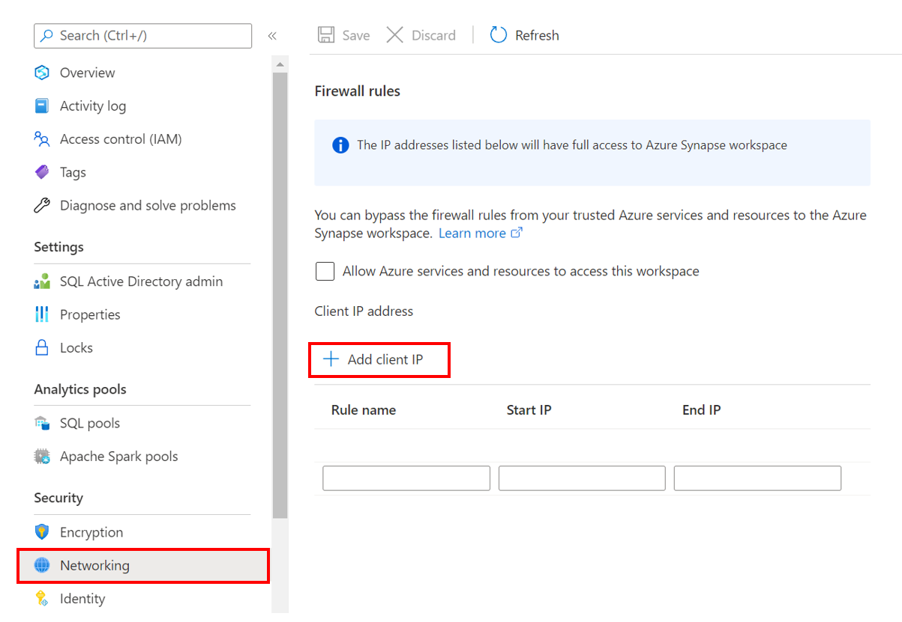
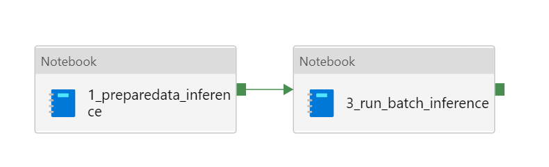

# Setup Guide 
Please follow the steps below to set up the Azure environment

# Step 1: Download Files
Clone or download this repository and navigate to the project's root directory.

# Step 2: Synapse Security Access

### Step 2.1: Add your IP address to Azure Synapse Analytics firewall
Before you can upload assests to the Synapse Workspace you will need to add your IP address:
1. Go to the Synapse resouce you created in the previous step. 
2. Navigate to `Networking` under `Security` on the left hand side of the page.
3. At the top of the screen click `+ Add client IP`
      
4. Your IP address should now be visible in the IP list and click `Save` at the top

### Step 2.2: Update storage account permissions
In order to perform the necessary actions in Synapse workspace, you will need to grant more access.
1. Go to the Azure Data Lake Storage Account for your Synapse Workspace
> * **Note**: you will see two storage accounts created in the resource group, be sure to select the Synapse Workspace Storage account and **not** the machine learning storage account
2. Go to the `Access Control (IAM) > + Add > Add role assignment` 
3. Now search and select the `Storage Blob Data Contributor` role and click "Next" 
4. Click "+ Select members", search and select your username and click "Select" 
5. Click `Review and assign` at the bottom

[Learn more](https://docs.microsoft.com/azure/synapse-analytics/security/how-to-set-up-access-control)

# Step 3: Upload Customer 360 Sample Dataset
1. Launch the Synapse workspace [Synapse Workspace](https://ms.web.azuresynapse.net/)
2. Select the `subscription` and `workspace` name you are using for this solution accelerator
3. In Synapse Studio, navigate to the `Data` Hub
4. Select `Linked`
5. Under the category `Azure Data Lake Storage Gen2` you'll see an item with a name like `xxxxx(xxxxx- Primary)`
6. Select the container named `Data (Primary)`, select "New Folder" enter `sourcedata` and select "Create" 
7. Select the `sourcedata` folder, select `Upload` and select following sample data files downloaded from [Data](https://github.com/microsoft/Azure-Synapse-Customer-Insights-Customer360-Solution-Accelerator/tree/main/Data) folder
	- `residents_source1.csv`
	- `residents_source2.csv`
	- `leases.csv`
	- `payments.csv`
	- `surveys.csv`
	- `workorders.csv`
	- `properties.csv`


# Step 4: Upload Assets and Run Noteboks
1. Launch the Synapse workspace [Synapse Workspace](https://ms.web.azuresynapse.net/)
2. Go to `Develop`, click the `+`, and click `Import` to select all notebooks from this repository's [folder](https://github.com/microsoft/Azure-Synapse-Customer-Insights-Customer360-Solution-Accelerator/tree/main/Code/SynapseNotebooks)
3. For each of the notebooks, select `Attach to > spark1` in the top dropdown
4. Configure the parameters in the following 6 notebooks and publish the changes
> * **Note**: Only change the parameters but **do not** run all the notebooks. You will run pipelines that will run notebooks 1-5 in later steps after the Customer Insights set up. 

* `00_prepare_sourcedata_for_ci.ipynb`

	``` 
		data_lake_account_name = '' # Synapse ADLS
		file_system_name = 'data'
		synapse_workspace_name = ''
	```

* `1_preparedata_from_ci.ipynb`
	``` 
	data_lake_account_name = '' # Synapse ADLS
	file_system_name = 'data'
	resident_file_name = "residents.csv"
	```
* `2_train_model.ipynb`
	``` 
	data_lake_account_name = "" # Synapse ADLS
	file_system_name = "data"
	table_name = "c360_data.prepareddata"

	#AML workspace details
	subscription_id = ""
	resource_group = ""
	workspace_name = ""
	```
* `3_preparedata_for_inference.ipynb`
	``` 
	data_lake_account_name = '' # Synapse ADLS
	file_system_name = 'data'

	resident_file_name = "residents.csv"
	```
* `4_run_batch_inference.ipynb`
	``` 
	data_lake_account_name = '' # Synapse ADLS
	file_system_name = 'data'

	table_name = "c360_data.preparedinferencedata"

	#AML workspace details
	subscription_id = ""
	resource_group = ""
	workspace_name = ""
	```
* `5_prepare_predictionsdata_for_ci.ipynb`
	``` 
	data_lake_account_name = '' # Synapse ADLS
	file_system_name = 'data'
	synapse_workspace_name = ''
	```

5. Run the following notebook
	* `00_prepare_sourcedata_for_ci.ipynb`
	
	
# Step 5: Set up the Customer Insights 
## Step 5.1: Add Dynamics 365 AI for Customer Insights Synapse Security Access 
In order to perform the necessary actions in Customer Insights, you will need to grant more access.
1. Go to the Azure Data Lake Storage Account for your Synapse Workspace
2. Go to the `Access Control (IAM) > + Add > Add role assignment` 
3. Now search and select the `Storage Blob Data Contributor` role and click "Next" 
4. Click "+ Select members", search and select `Dynamics 365 AI for Customer Insights` and click "Select" 
5. Click `Review and assign` at the bottom

> * **Note**: if you cannot find the `Dynamics 365 AI for Customer Insights` service principle, [Follow the steps here](https://docs.microsoft.com/en-us/dynamics365/customer-insights/audience-insights/connect-service-principal#grant-permissions-to-the-service-principal-to-access-the-storage-account) to grant the `Dynamics 365 AI for Customer Insights` access to the ADLS Gen 2 storage account you are using for this solution.

## Step 5.2: Set Up CI
1. Navigate to the [CI Set Up Documentaion](./CustomerInsightsSetup.md) and follow the steps to set up the Customer Insights Environment. 

# Step 6: Set Up AML Pipeline
1. Launch the Azure Machine Learning studio [AML Studio](https://ml.azure.com/)
2. Go to the `Notebooks` tab in the AML Studio and upload the `AML Notebooks` folder
3. Go to the `Compute` tab in the AML Studio and click on the `Compute Instances` 
4. Click `New`, select `Standard_DS11_v2` for Virtual Machine Size and click on `Create` to create a new compute instance
5. Once the state of compute instance changes from `Creating` to `Running`, click on `Jupyter` under Applications to launch the compute instance
6. Run the following notebooks in order:
	- `CreateTrainingPipeline.ipynb`
	- `CreateInferencingPipeline.ipynb` (This step publishes a pipeline that will be used in Customer Insights set up)

# Step 7: Set up Synapse Pipeline
In order to run the pipelines, you will need to grant more access.
1. In the Azure Portal, select the Azure Machine Learning Service created above
2. Go to the `Access Control (IAM) > + Add > Add role assignment` 
3. Now click the Role dropdown and select `Contributor`
    - Search for your Synapse Workspace and add
4. Click `Save` at the bottom

## Step 7.1: Training Pipeline 
In this step you will create the Training Pipeline 
> * **Note:** You will need to manually connect each object in the pipeline.

1. Launch the Synapse workspace [Synapse Workspace](https://ms.web.azuresynapse.net/)
2. Go to `Integration`, click `+` and click `Pipeline` 
3. Under Properties provide the pipeline with the following name `TrainingPipeline`
4. Click the "{}" button at the top right corner to open the Code window
5. Copy and paste the contents of [TrainingPipeline.json](https://github.com/microsoft/Azure-Synapse-Customer-Insights-Customer360-Solution-Accelerator/blob/main/Code/SynapsePipelines/TrainingPipeline.json)
6. Click OK to apply
7. Click "Publish All" > "Publish"
8. Trigger the pipeline
	* In the designer, click "Add Trigger" > "Trigger Now". The final pipeline should look like:
	

## Step 7.2: Inferencing Pipeline
In this step you will create the Inferencing Pipeline 
> * **Note:** You will need to manually connect each object in the pipeline.

1. Launch the Synapse workspace [Synapse Workspace](https://ms.web.azuresynapse.net/)
2. Go to `Integration`, click `+` and click `Pipeline` 
3. Under Properties provide the pipeline with the following name `InferencingPipeline`
4. Click the "{}" button at the top right corner to open the Code window
5. Copy and paste the contents of [InferencingPipeline.json](https://github.com/microsoft/Azure-Synapse-Customer-Insights-Customer360-Solution-Accelerator/blob/main/Code/SynapsePipelines/InferencingPipeline.json)
6. Click OK to apply
7. Click "Publish All" > "Publish"
8. Trigger the pipeline
	* In the designer, click "Add Trigger" > "Trigger Now". The final pipeline should look like:
	

## Step 7.3: Run Notebook  
1. Launch the Synapse workspace [Synapse Workspace](https://ms.web.azuresynapse.net/)
4. Configure the parameters and Run the notebooks in the following order
	* `5_prepare_predictionsdata_for_ci.ipynb`


# Step 8: Continue with CI Set Up 
1. Navigate to Step 4 in the [CI Set Up Documentaion](https://github.com/microsoft/Azure-Synapse-Customer-Insights-Customer360-Solution-Accelerator/blob/main/Deployment/CustomerInsightsSetup.md#step-4-relationship)