# Dynamics Customer Insights Deployment  
Please follow the steps below to set up the Customer Insights (CI) environment

# Step 1: Setup Customer Insights Environment
In this step you will create a Customer Insights environment, that you will use for this solution accelerator. 

1. Navigate to the [Customer Insights workspace](https://home.ci.ai.dynamics.com/) to create a new environment 
2. Provide a name for your workspace, select `Production` under "Type", select the region your Azure resources are deployed under "Region" 

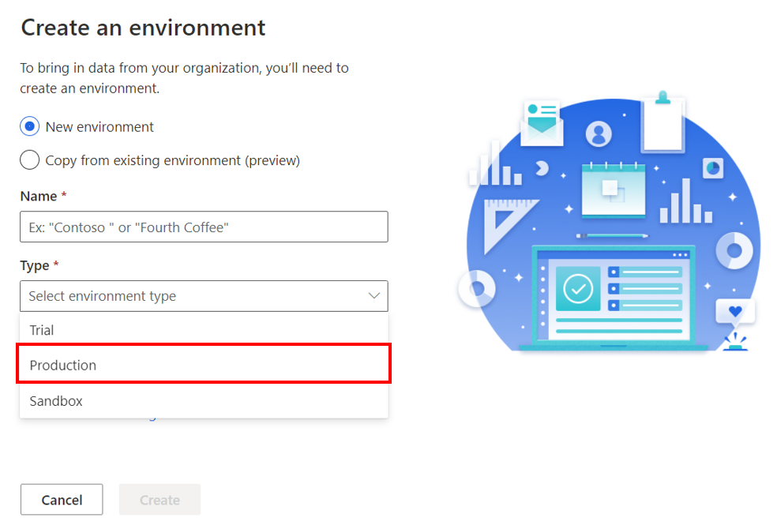 

3. In the Advance Settings, select `Azure Data Lake Storage Gen 2` under "Save output to" 
4. Select `Azure subscription` under "Connect your storage account using"  
    * choose your Subscription, Resource Group, Storage Account 

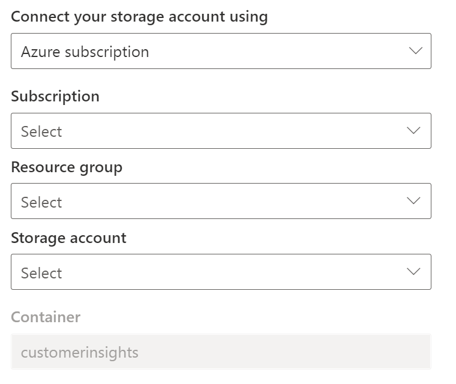

# Step 2: Ingest Data
In this step you will bring the data into the CI environment from your Azure Synapse Workspace. 
1. In the CI environment, navigate to the Data > Data Source
2. Select `Add Data Source` and select `Connect to a Common Data Model folder`, provide a name for your Common Data Model folder and click "Next". 

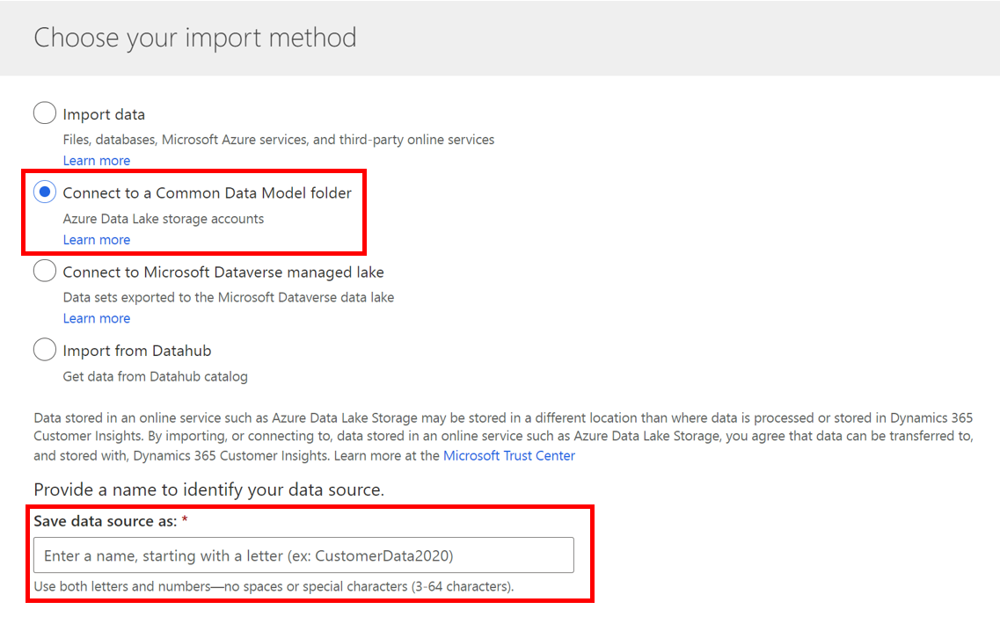 

3. Under "Connect your storage account using" select `Azure subscription`

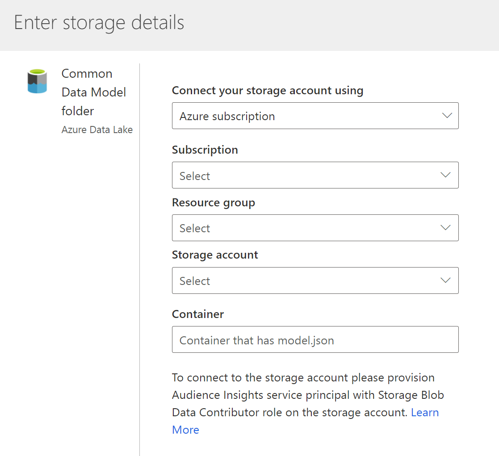

4. Select `/default.manifest.cdm.json` and click "Next"

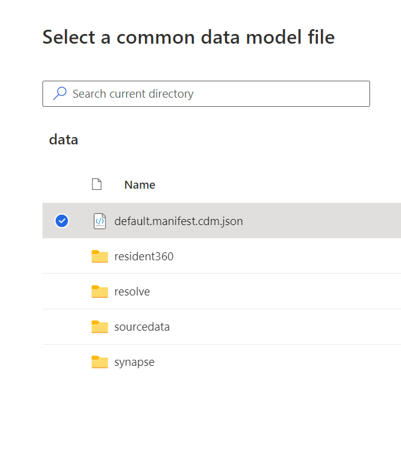

5. Select all model entities and click "Next"

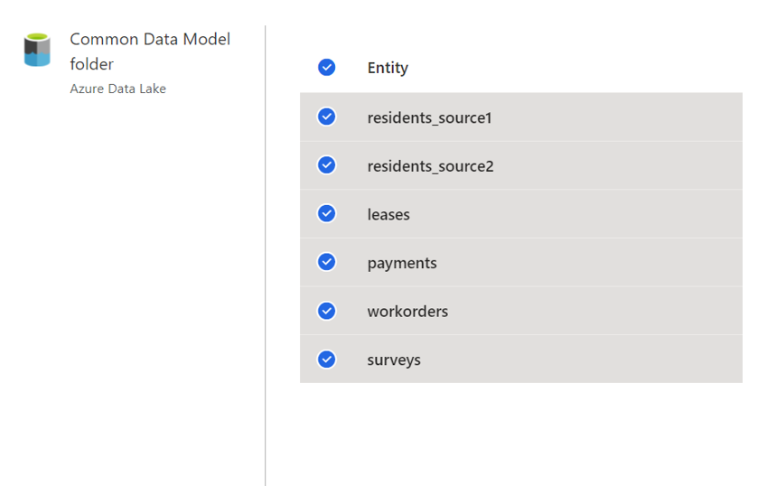

6. Select all entities to enable data profiling and select "Save"

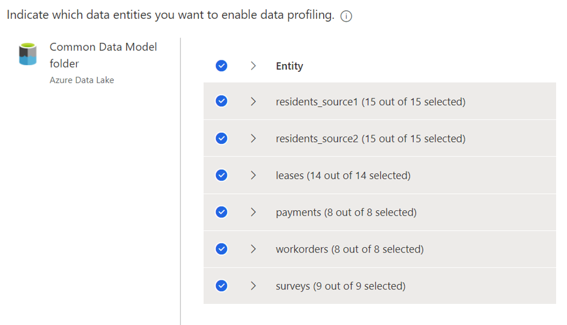

# Step 3: Unify Data
* Navigate to the Data Sources > Unify tab to Map, Match and Merge your data

## Step 3.1: Map
In order to merge the data in later steps you will need to map at least 2 entities.

Mapping happens against default CI field types (e.g. ID, Person.Age, Location.City). This unifies data ingested from different sources and formats/types used in those sources.

1. Under Unify > Map select `residents`, set "cid" to `Person`, set the primary key to `cid` 

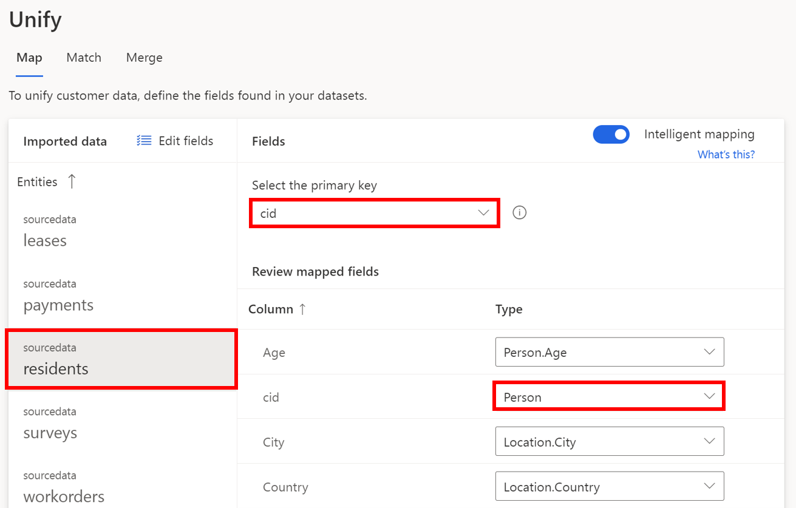

* **Note**: Repeat the steps above for each source dataset below

2. Select `leases`, set "cid" to `Person`, set the primary key to `lid`
<!---
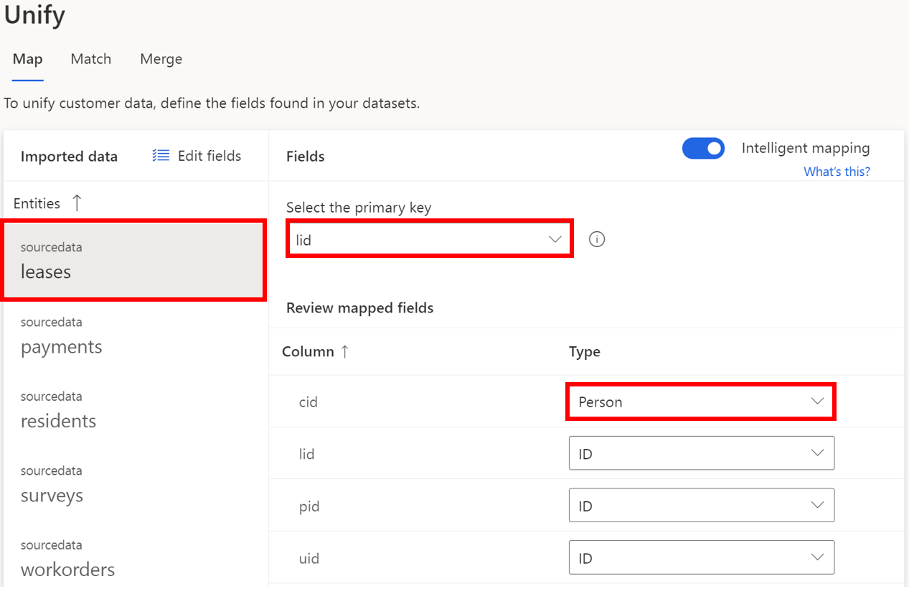
--->
3. Select `payments`, set "cid" to `Person`, set the primary key to `paymentid`
<!---
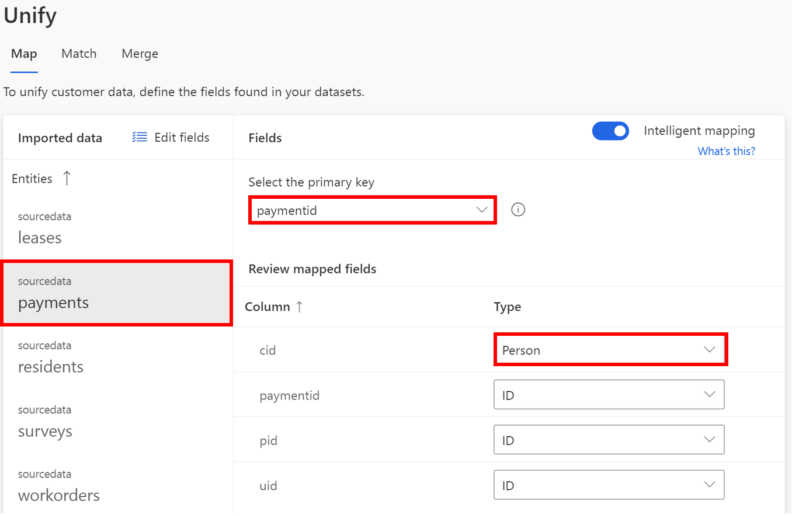
--->
4. Select `surveys`, set "cid" to `Person`, set the primary key to `sid`
<!--
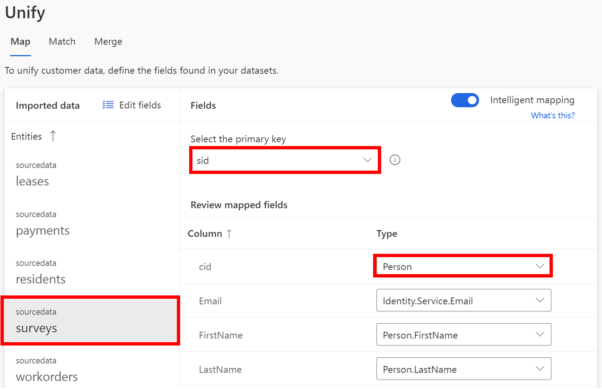
--->

5. Select `workorder`, set "cid" to `Person`, set the primary key to `wid`
<!---
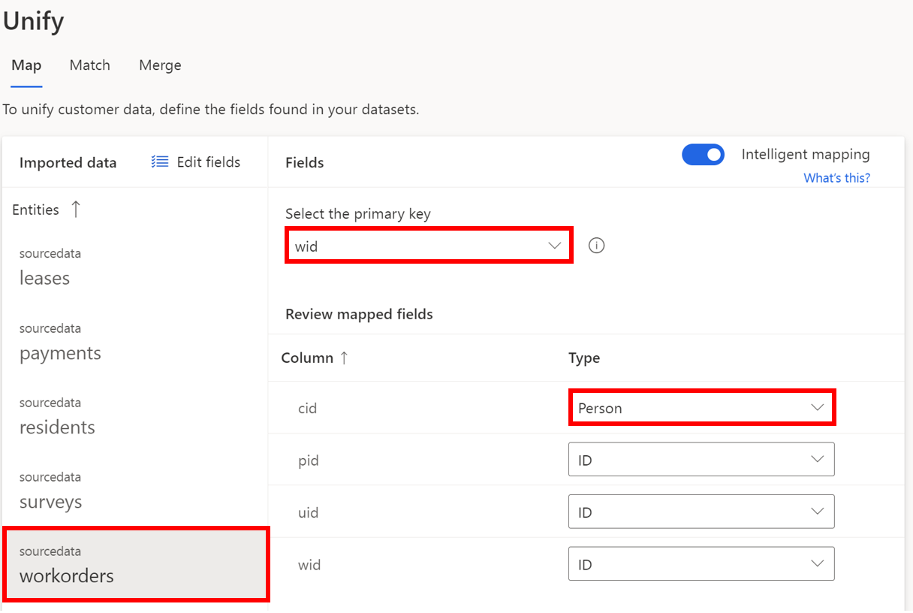
--->
6. Click "Save" 

## Step 3.2: Match
Match records between entities based on matching IDs. 

1. Select "+ Add entity" and select `sourcedata:residents_source1` 
2. Select "+ Add entity" and `sourcedata:residents_source2`
3. Select "+ Add entity" and select `sourcedata:surveys` 
4. Select "+ Add rule" under `sourcedata:residents_source2`
5. Under "Select entity"  select `residents_source1:sourcedata`, "Select field" `Email`, "Normalize" `Whitespaces, Symbols, Text to lower case, and Numerals`
6. Provide a name for the match rule

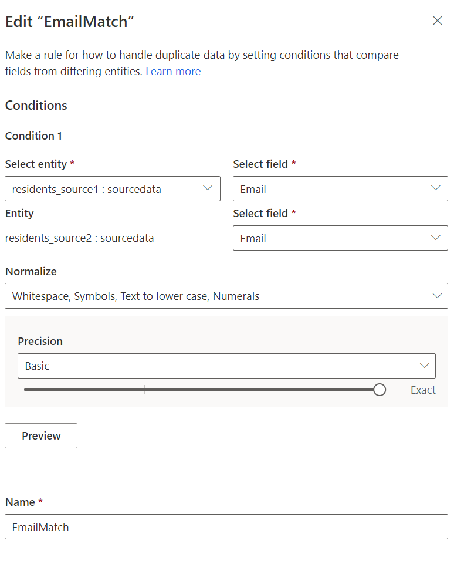 

7. Under Deduplicated Records select `sourcedata:residents_source1` and `sourcedata:residents_source2`
8. Select "+ Add rule" under sourcedata:residents_source1, set the field to `cid`, provide a name for the rule and click "Done" 

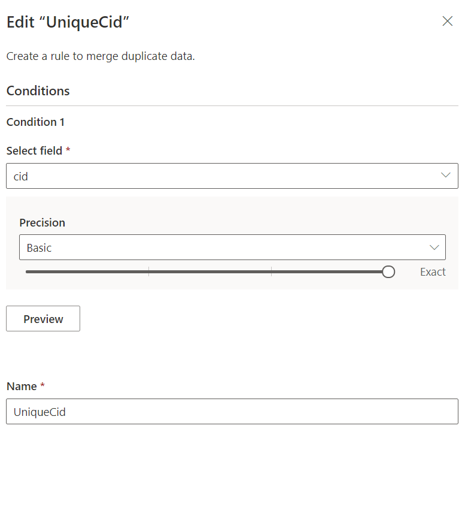

9. Select "+ Add rule" under sourcedata:surveys, set the field to `resident_source1:sourcedata`, set both fields to `Email`, set Normalize to `Whitespaces, Symbols, Text to lower case, and Numerals`, provide a name for the match rule, and click "Done"  
10. Repeat step 9 for `resident_source2:sourcedata`

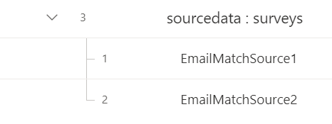

11. Click "Save" in the top of the Match page and click "Run" 

## Step 3.3: Merge
The last step is merging the records. If fields need to be combined, that can be done as well. 
1. Select each `FirstName` column from the list

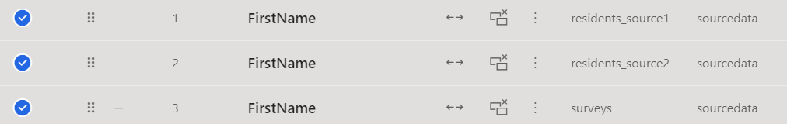

2. Select "Combine" at the top of the Merge page

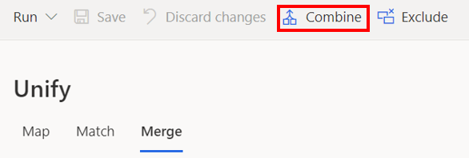

3. Repeat these steps for Name, LastName, Gender, Telephone, Country, StreetAddress, City, State, PostCode, DateofBirth, CreatedDate, Source, and Email 
    * **Note**: Only combine the Email for `resident_source1` and `resident_source2`

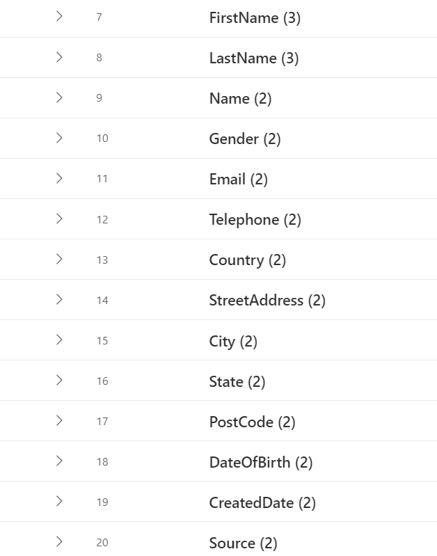

4. Rename the Email column from the surveys dataset to `SurveyEmail`

## Step 3.4: Export
1. Navigate to the Data > Export tab and click "+ Add export" 
2. Select "+ Add Connection", select Azure Synapse Analytics 
    * Enter `CISynapseConnection` for the Display name, select your Azure Subscription and Azure Synapse worksapce you are using for this solution accelerator
    * Select 'I Agree' check box for Data privacy and compliance and click "Save"

    

3. Provide `CustomerProfileExport` for the Display name, enter `ciexport` for Database name, select "Customer" under Profiles and click "Save"  

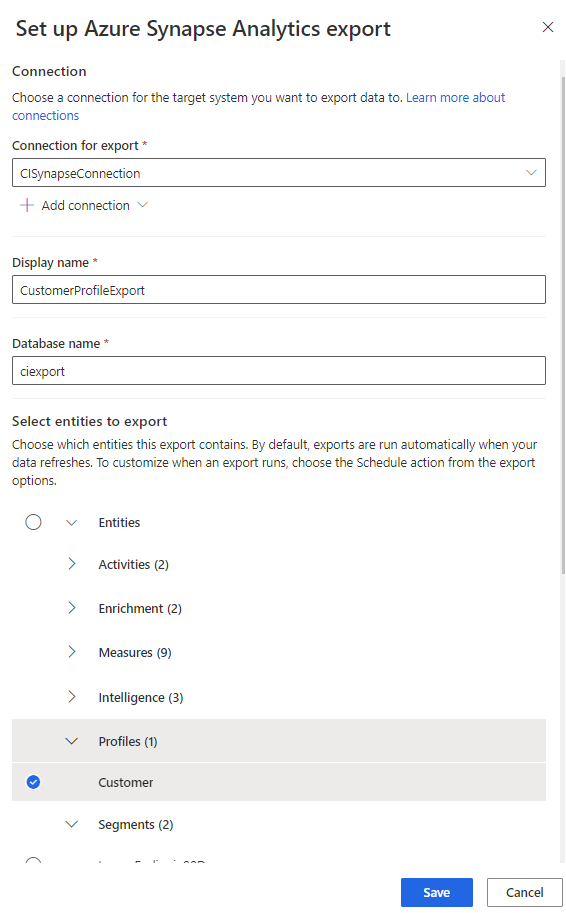

# Step 4: Relationship
Define the relationship between the Activity Entity 

## Step 4.1: Resident Payment Source 1
1. Navigate to the Data > Relationship tab and click "+ New relationship"
2. Provide a name for the relationship 
3. Under Source details select `payments:sourcedata` for "Entity", `Many` for "Cardinality" and `cid` for "Source field"
4. Under Target details select `residents_source1:sourcedata` for "Entity", `One` for "Cardinality" and `cid` for "Target field" and click "Save"

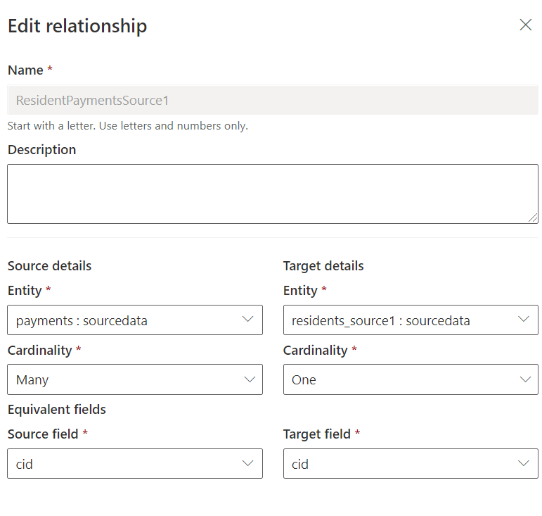

## Step 4.2: Resident Payment Source 2
1. Navigate to the Data > Relationship tab and click "+ New relationship"
2. Provide a name for the relationship 
3. Under Source details select `payments:sourcedata` for "Entity", `Many` for "Cardinality" and `cid` for "Source field"
4. Under Target details select `residents_source2:sourcedata` for "Entity", `One` for "Cardinality" and `cid` for "Target field" and click "Save"

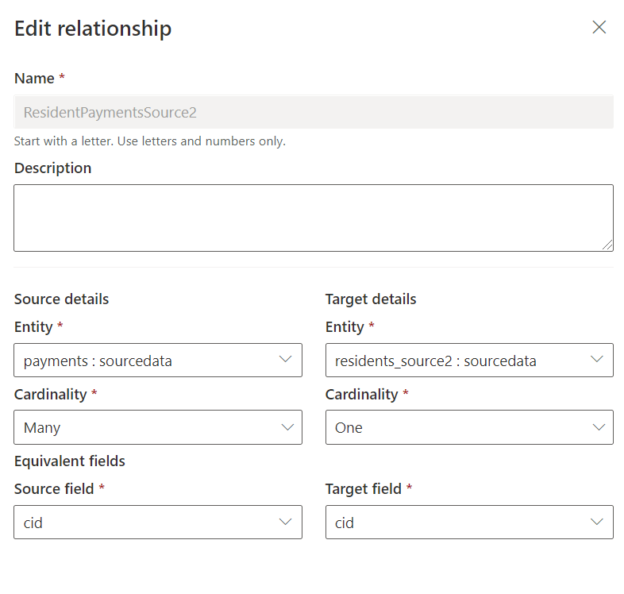

## Step 4.3: Resident Lease Source 1
1. Provide a name for the relationship 
2. Under Source details select `leases:sourcedata` for "Entity", `Many` for "Cardinality" and `cid` for "Source field"
3. Under Target details select `residents_source1:sourcedata` for "Entity", `One` for "Cardinality" and `cid` for "Target field" and click "Save"

## Step 4.4: Resident Lease Source 2
1. Provide a name for the relationship 
2. Under Source details select `leases:sourcedata` for "Entity", `Many` for "Cardinality" and `cid` for "Source field"
3. Under Target details select `residents_source2:sourcedata` for "Entity", `One` for "Cardinality" and `cid` for "Target field" and click "Save"

## Step 4.5: Resident Work Orders Source 1
1. Provide a name for the relationship 
2. Under Source details select `workorders:sourcedata` for "Entity", `Many` for "Cardinality" and `cid` for "Source field"
3. Under Target details select `residents_source1:sourcedata` for "Entity", `One` for "Cardinality" and `cid` for "Target field" and click "Save"

## Step 4.6: Resident Work Orders Source 2
1. Provide a name for the relationship 
2. Under Source details select `workorders:sourcedata` for "Entity", `Many` for "Cardinality" and `cid` for "Source field"
3. Under Target details select `residents_source2:sourcedata` for "Entity", `One` for "Cardinality" and `cid` for "Target field" and click "Save"

# Step 5: Activities
In this step, you will create an activity for WorkOrders, Leases, and Payments

## Step 5.1: Work Order Activity
1. Navigate to the Data > Activites tab and click "Add activity" 
2. Provide a name for the activity, select `workorders:sourcedata` under "Entity", select `wid` under "Primary key" and click "Next"

3. Select "+ Add relationship", select `cid` from resident_source1 as the Foreign key 
4. Select "+ Add another relationship", select `cid` from resident_source2 as the Foreign key and select "Next"

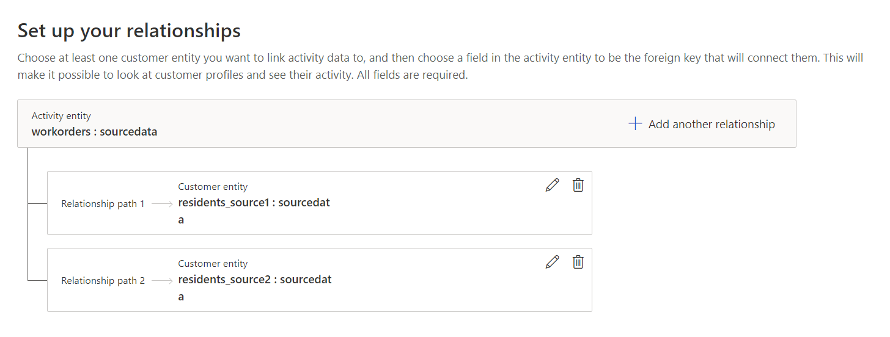

5. Select `workorder_type` for "Event activity", `ServiceCompleteDate` for "Timestamp", `ServiceRequestDate` for "Additional details", `Yes` under "Show this information in the timeline view on your customer profile?" and click "Next" 

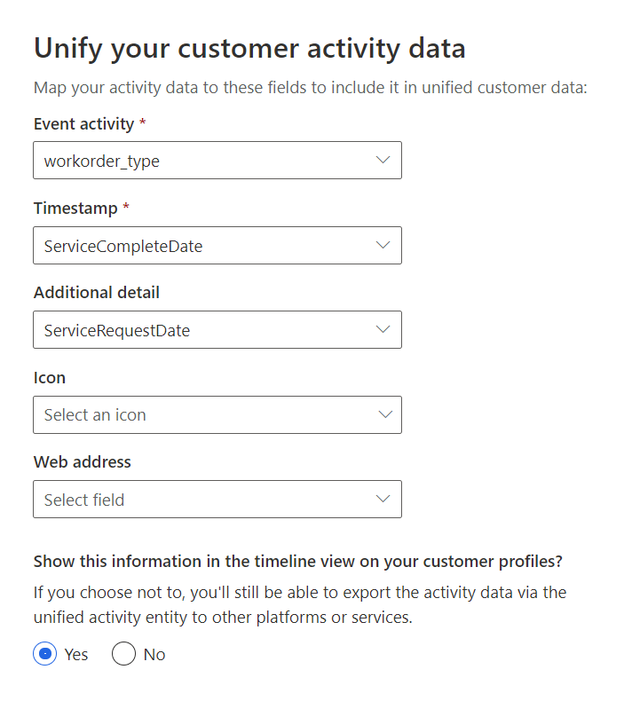

6. Select `ServiceActivity` for "Activity type" and click "Next" 

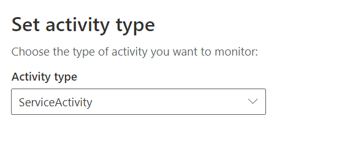

7. Review and Save the Activity 

## Step 5.2: Payment Activity 
1. Navigate to the Data > Activites tab and click "Add activity" 
2. Provide a name for the activity, select `payments:sourcedata` under "Entity", select `paymentid` under "Primary key" and click "Next"
3. Select "+ Add relationship", select `cid` from resident_source1 as the Foreign key 
4. Select "+ Add another relationship", select `cid` from resident_source2 as the Foreign key and select "Next"
5. Select `amount` for "Event activity", select `paymentdate` for "Timestamp", `paymentmethod` for "Additional details", the shopping bag for "Icon", `Yes` under "Show this information in the timeline view on your customer profile?" and click "Next" 
6. Select `SalesOrderLine` for Activity type and select `yes` to enable semantic mapping
7. Select `paymentid` for "Order line ID", `paymentid` for "Order ID", `paymentdate` for "Order date", `amount` for Amount" and click "Next"  

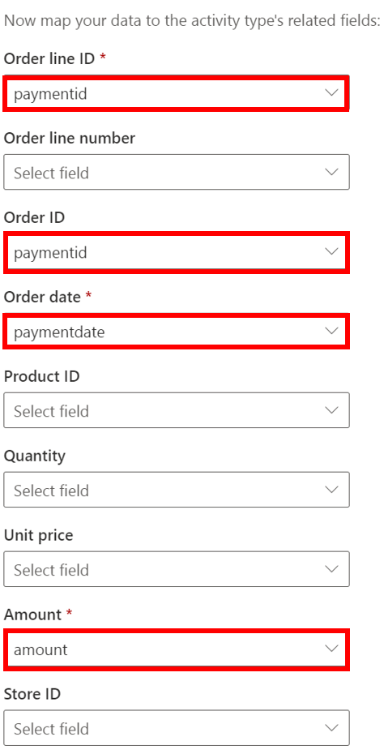

8. Review and Save the Activity 

## Step 5.3: Leases
1. Navigate to the Data > Activites tab and click "Add activity" 
2. Provide a name for the activity, select `leases:sourcedata` under "Entity", select `lid` under "Primary key" and click "Next"
3. Select "+ Add relationship", select `cid` from `resident_source1` as the Foreign key 
4. Select "+ Add another relationship", select `cid` from `resident_source2` as the Foreign key and select "Next"
5. Select `Type` for "Event activity", select `SignedDate` for "Timestamp", `LeaseTerm` for "Additional details", `Yes` under "Show this information in the timeline view on your customer profile?" and click "Next" 
6. Select `Subscription` for Activity type and select `yes` to enable semantic mapping
7. Select `lid` for "Transaction ID", `SignedDate` for "Transaction Date", `lid` for "Subscription ID", `StartDate` for "Subscription start date", `EndDate` for "Subscription end date", `Type` for "Subscription Type" and click "Next"  
8. Review and Save the Activity 
9. Click "Run" at the top of the Activities page 

# Step 6: Measures
In this step you will create Measures for Leases Ending in 90 Days, Life Time Value, and  Number of Air Conditioning Work Orders. These Measures can be used in Segments 

## Step 6.1: Leases Ending in 90 Days Source 1
1. Navigate to the Measure tab, click "+ New" and select "Build your own" 
2. Select "Dimensions", click the trash can icon to remove the dimension and click "Apply" 

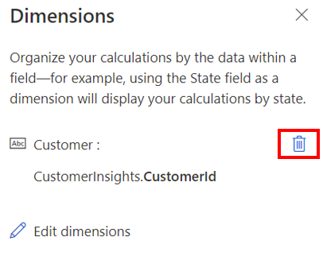

3. Select "Edit name" and provide a name for your measure

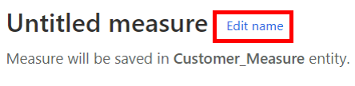

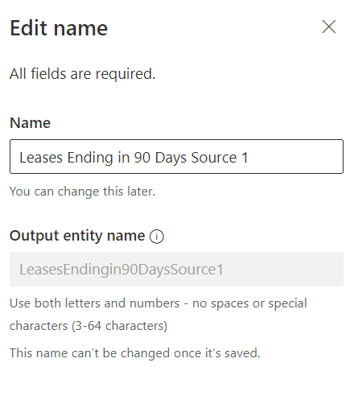

4. Select "Filter", select `sourcedata_leases.EndDate` from the attributes list, set the filter to before 90 days after today
5. Select `sourcedata_leases.EndDate` from the attributes list, set the filter to after 0 days before today and click "Apply"

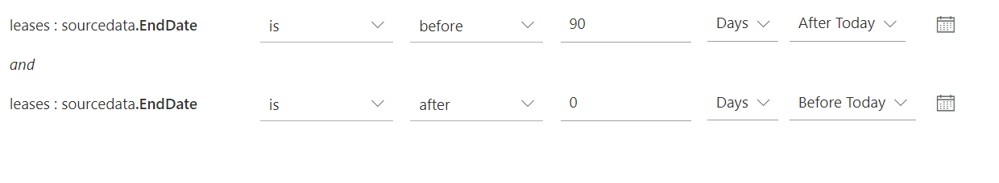

6. Select "Edit name" under the Calculation, provide `Lease Ending in 90 Days Source 1` for the calculation name, select "count" from the dropdown, select "+ Add attribute", select `sourcedata_leases.lid` and select "Add" 

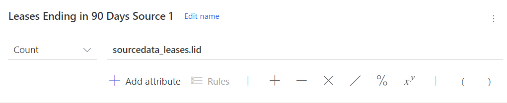

7. Click "Save and close" 
8. Select Edit on the "Lease Ending in 90 Days Source 1"  

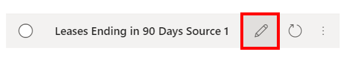

9. Select "Dimensions", select `CustomerInsights.CustomerId` and select "Apply"  

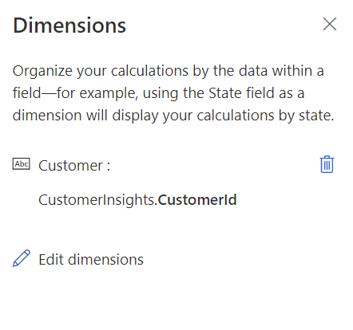

10. Select "Relationship", select `sourcedata_leases > sourcedata_residents_source1 > Customer` and select "Done"

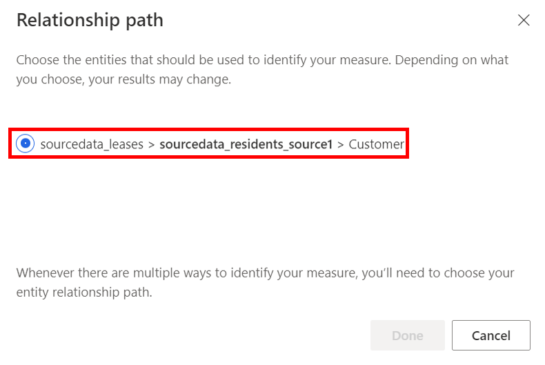

11. Select "Run" 

## Step 6.2: Lease Ending in 90 Days Source 2
Repeat the steps from 6.1 for Source 2
1. Navigate to the Measure tab, click "+ New" and select "Build your own" 
2. Select "Dimensions", click the trash can icon to remove the dimension and click "Apply" 

3. Select "Edit name" and provide `Lease Ending in 90 Days Source 2` for your measure name
4. Select "Filter", select `sourcedata_leases.EndDate` from the attributes list, set the filter to before 90 days after today
5. Select `sourcedata_leases.EndDate` from the attributes list, set the filter to after 0 days before today and click "Apply"

6. Select "Edit name" under the Calculation, provide `Lease Ending in 90 Days Source 2` for the calculation name, select "count" from the dropdown, select "+ Add attribute", select `sourcedata_leases.lid` and select "Add" 
7. Click "Save and close" 
8. Select Edit on the "Lease Ending in 90 Days Source 2"  
9. Select "Dimensions", select `CustomerInsights.CustomerId` and select "Apply"  

10. Select "Relationship", select `sourcedata_leases > sourcedata_residents_source2 > Customer` and select "Done"
11. Select "Run" 

## Step 6.3: Lease Ending in 90 Days 
Repeat the steps from 6.1 and 6.2 to combine the two measures 
1. Navigate to the Measure tab, click "+ New" and select "Build your own" 
2. Select "Dimensions", click the trash can icon to remove the dimension and click "Apply" 

3. Select "Edit name" and provide `Lease Ending in 90 Days` for your measure name
4. Select "Edit name" under the Calculation, provide `Lease Ending in 90 Days` for the calculation name and click "Done" 
5. Select Sum from the drop down 
6. Select "+ Add attribute", select "Measures", select `LeasesEndingin90DaysSource1.LeasesEndingin90DaysSource1` from the measures list and click "Add"  

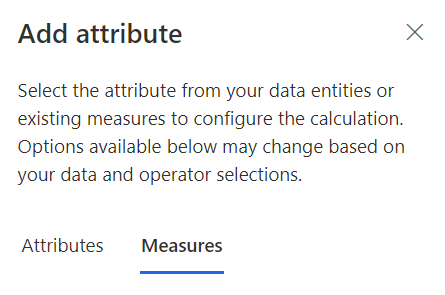

7. Select "+", select "Add atributes", select "Measures", select `LeasesEndingin90DaysSource2.LeasesEndingin90DaysSource2` from the measures list and click "Add" 

8. Click "Save and close" 
9. Select Edit on the "Lease Ending in 90 Days"   
10. Select "Dimensions", select `CustomerInsights.CustomerId` and select "Apply"  

11. Select "Run" 

## Step 6.4: Lease Life Time Value 
1. Navigate to the Measure tab, click "+ New", select "Choose a template" and select "Get started"

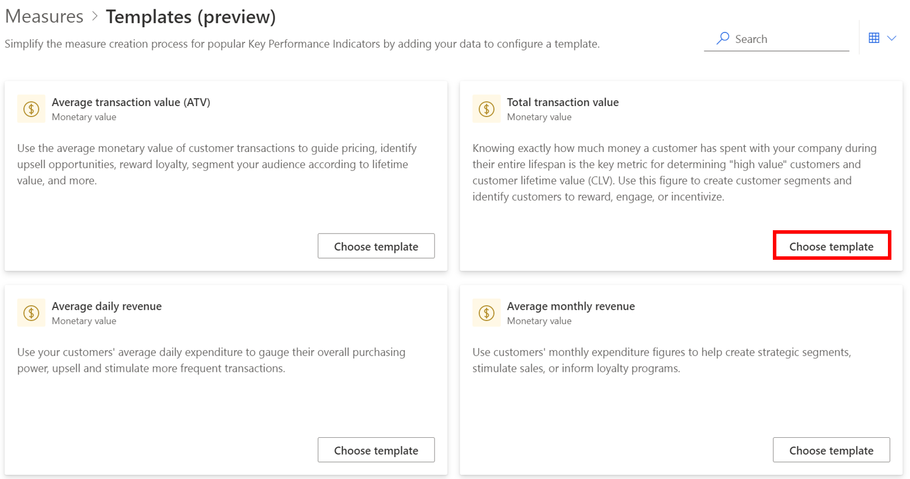

2. Select `All time` for "Set time period" and click "+ Add data" 

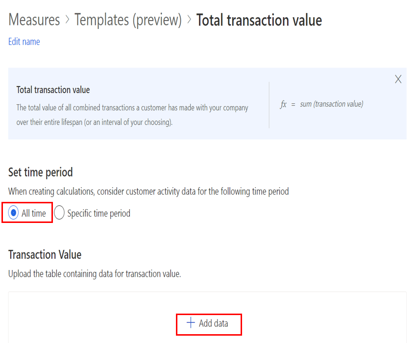

3. Select `SalesOrderLine` from the dropdown and select "Next"
4. Select  `SalesOrderLine` for the Activity type, `SalesOrderLine:CustomerInsights` for Activity entity, `sourcedata_payments` for Activities and click "Next"

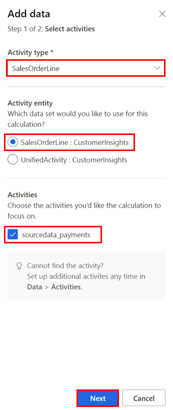

4. Select Transaction value and Activity timestamp as shown below and click "Save" 

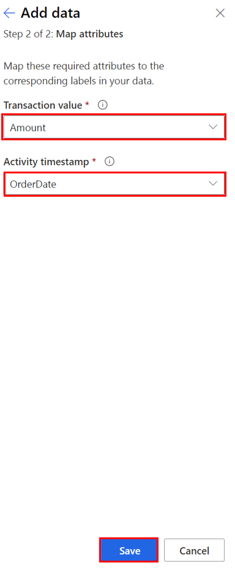

5. Change the name of the measure to `TTV`

## Step 6.5: Customer Life Time Value 
1. Navigate to the Measure tab, click "+ New" and select "Build your own" 
2. Select "Edit name" and provide `CTTV` or your measure name
3. Select "Edit name" under the Calculation, provide `CTTV` for the calculation name and click "Done" 
4. Select Max from the dropdown 
5. Select "+ Add attribute", select "Measures", select `TTV.TTV` from the measures list and click "Add" 
6. Click "Run" 

## Step 6.5: Number of Air Conditioning Work Orders Source 1
1. Navigate to the Measure tab, click "+ New" and select "Build your own" 
2. Select "Dimensions", click the trash can icon to remove the dimension and click "Apply" 

3. Select "Edit name" and provide `Number of Air Conditioning Work Orders Source 1` for your measure name
4. Select Filter, select `sourcedata_workorders.Workorder_type` from the attributes list, set the filter to is equal to Air Conditioning, select "Ignore case" and click "Apply"

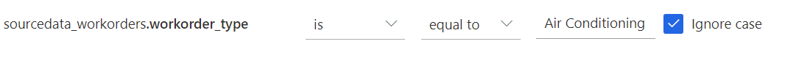

5. Select "Edit name" under the Calculation, provide `Number of Air Conditioning Work Orders Source 1` for the calculation name, select "count" from the dropdown, select "+ Add attribute", select `sourcedata_workorders.wid` and select "Add" 
6. Click "Save and close" 
7. Select Edit on the "Number of Air Conditioning Work Orders Source 1"  
8. Select "Dimensions", select `CustomerInsights.CustomerId` and select "Apply"  

9. Select "Relationship", select `sourcedata_workorders > sourcedata_residents_source1 > Customer` and select "Done"
10. Select "Run" 

## Step 6.6: Number of Air Conditioning Work Orders Source 2
Repeat the steps from 6.5 for Source 2
1. Navigate to the Measure tab, click "+ New" and select "Build your own" 
2. Select "Dimensions", click the trash can icon to remove the dimension and click "Apply" 

3. Select "Edit name" and provide `Number of Air Conditioning Work Orders Source 2` for your measure name
4. Select Filter, select `sourcedata_workorders.Workorder_type` from the attributes list, set the filter to is equal to Air Conditioning, select "Ignore case" and click "Apply"

5. Select "Edit name" under the Calculation, provide `Number of Air Conditioning Work Orders Source 2` for the calculation name, select "count" from the dropdown, select "+ Add attribute", select `sourcedata_workorders.wid` and select "Add" 
6. Click "Save and close" 
7. Select Edit on the "Number of Air Conditioning Work Orders Source 2"  
8. Select "Dimensions", select `CustomerInsights.CustomerId` and select "Apply"  

9. Select "Relationship", select `sourcedata_workorders > sourcedata_residents_source2 > Customer` and select "Done"
10. Select "Run" 

## Step 6.7: Number of Air Conditioning Work Orders 
Repeat the steps from 6.5 and 6.6 to combine the two measures 
1. Navigate to the Measure tab, click "+ New" and select "Build your own" 
2. Select "Dimensions", click the trash can icon to remove the dimension and click "Apply" 

3. Select "Edit name" and provide `Number of Air Conditioning Work Orders` for your measure name
4. Select "Edit name" under the Calculation, provide `Number of Air Conditioning Work Orders` for the calculation name and click "Done" 
5. Select Sum from the drop down 
6. Select "+ Add attribute", select "Measures", select `NumberofAirConditioningWorkOrdersSource1.NumberofAirConditioningWorkOrdersSource1` from the measures list and click "Add" 
7. Select "+", select "+ Add attribute", select "Measures", select `NumberofAirConditioningWorkOrdersSource2.NumberofAirConditioningWorkOrdersSource2` from the measures list and click "Add" 

8. Click "Save and close" 
9. Select Edit on the "Number of Air Conditioning Work Orders"   
10. Select "Dimensions", select `CustomerInsights.CustomerId` and select "Apply"  

12. Select "Run" 

## step 6.8 : CSAT Measure 
1. Navigate to the Measure tab, click "+ New" and select "Build your own" 
2. Select "Edit name" and provide `CSAT` or your measure name
3. Select "Edit name" under the Calculation, provide `CSAT` for the calculation name and click "Done" 
4. Select Average from the dropdown 
5. Select "+ Add attribute", select `sourcedata_surveys.answer` from the attributes list and click "Add", select "*" and enter 20 
6. Click "Run" 

# Step 7: Segments

## Step 7.1: Residents Lease Ending in 90 Days with Air Conditioning Work Orders 
1. Navigate to the Segments tab and click "+ New", select "Blank segment", click "Edit details" and provide a name for your segment.

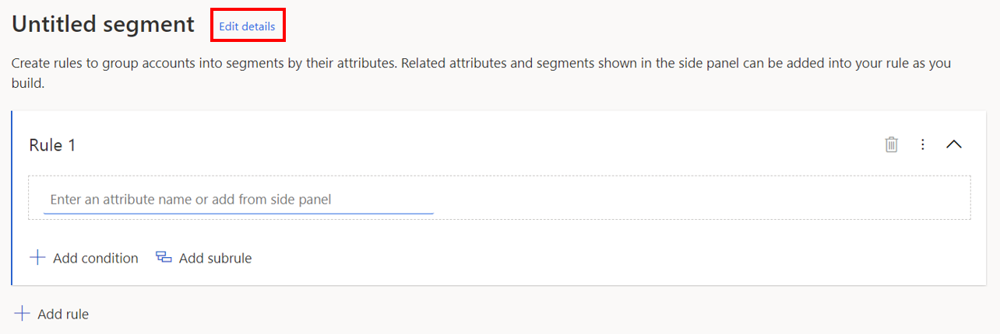

2. Select the `LeasesEndingin90Days.LeasesEndingin90Days` measure from the Attributes list, select "greater than or equal to" from the dropdown and enter "1" under Enter Value
3. Select the dropdown and select "Intersect" 
3. Select "+ Add rule", select the `NumberofAirConditioningWorkOrders.NumberofAirConditioningWorkOrders` measure from the Attributes list, select "greater than or equal to" from the dropdown and enter "1" under Enter Value, and select "Save"

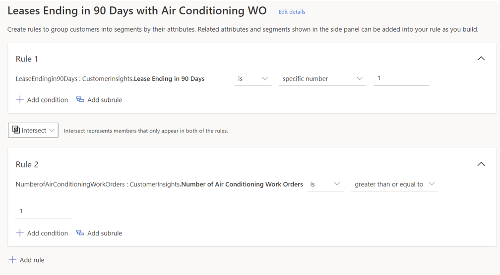

## Step 7.2: Residents Lease Ending in 90 Days 
Follow steps 1-3 above and click "Save" 

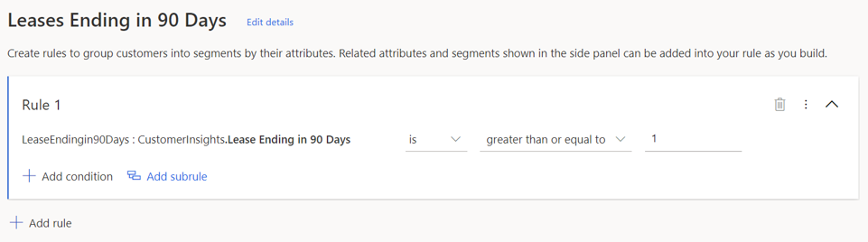

## OPTIONAL Step 7.3: Export to Dynamics 365 Marketing
Now that you have created segments in the CI environment, you can export the data to Dynamics 365 Marketing 

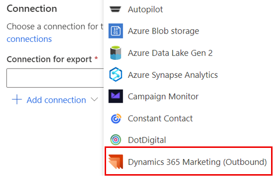

# Step 8:  Intelligence
## Predictions

Customer Insights comes with some out-of-box prediction models.
- Customer Lifetime Value (CLTV)
- Customer Churn Model
- Product Recommendations

For the purpose of this solution accelerator, we will use the following model(s) as examples. They can be created based on your specific definitions and calculations:
- Resident CLTV

## Step 8.1: CLTV Model 
1. Navigate to the Intelligence > Predictions tab, select "Create" and select "Use model" on the "Customer lifetime value (preview)" model  

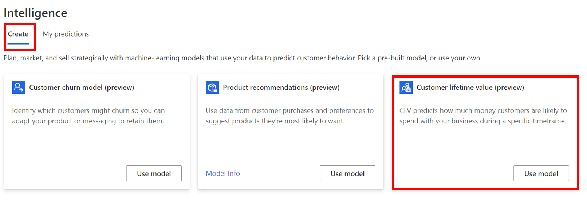

2. Select "Get started" 

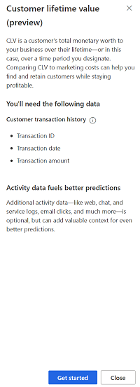

3. Provide a name for your model
4. Select "3 Month(s)" under "Predict customer value over the next:"
5. Select "Let model calculate purchase interval (recommended)"  under "An active customer has spent money on your products or services in the last:" 
6. Select "Model calculations (recommended)" under " Determin high-value customers using:"
7. click "Next" 

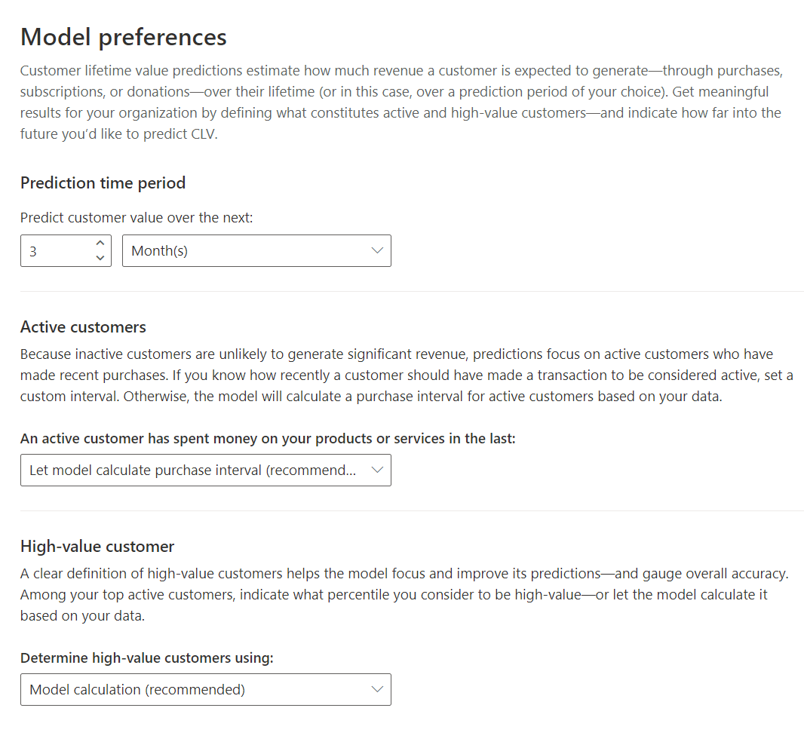

8. Select "+ Add data", select "SalesOrderLine" from the dropdown, select "payments:sourcedata" under Activities and click "Next" 
9. Keep the default values and click "Save" 
10. Leave "Additional data (optional)" blank and click "Next"
11. Select "Never" under "Automatically import updated data" and click "Next"
12. Click "Run" to save and run the model 

## Step 8.2: CLTV Measure 
1. Navigate to the Measure tab, click "+ New" and select "Build your own" 
2. Select "Dimensions", click the trash can icon to remove the dimension and click "Apply" 

3. Select "Edit name" and provide `CLTV` for your measure name
4. Select "Edit name" under the Calculation, provide `CLTV` for the calculation name and click "Done" 
5. Select Sum from the drop down 
6. Select "+ Add attribute",  select `CLTVModel.CLVScore` from the attributes list and click "Add"  
8. Click "Save and close" 
9. Select Edit on the "CLTV"   
10. Select "Dimensions", select `CustomerInsights.CustomerId` and select "Apply"  

11. Select "Run" 

## Step 8.3: AML Custom Model 
* Navigate to Intelligence > Custom models and select "+ New workflow" 
* Provide a Name, select your tenant and Azure Machine Learning workspace, select your AML PiIpeline name for "Web service that contains your model" and click "Next

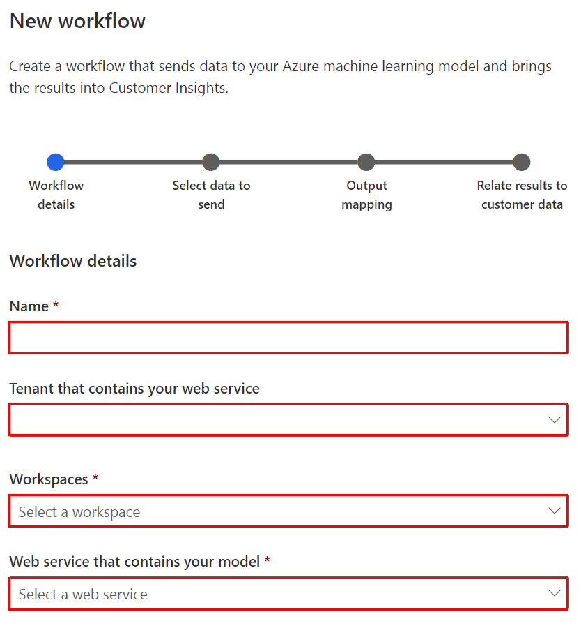

* Select the Entity for each of the "Web service input" as shown below and click "Next"

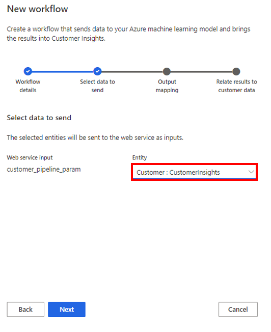

* Provide an entity name, an output data store and output path as shown below and click "Next" 

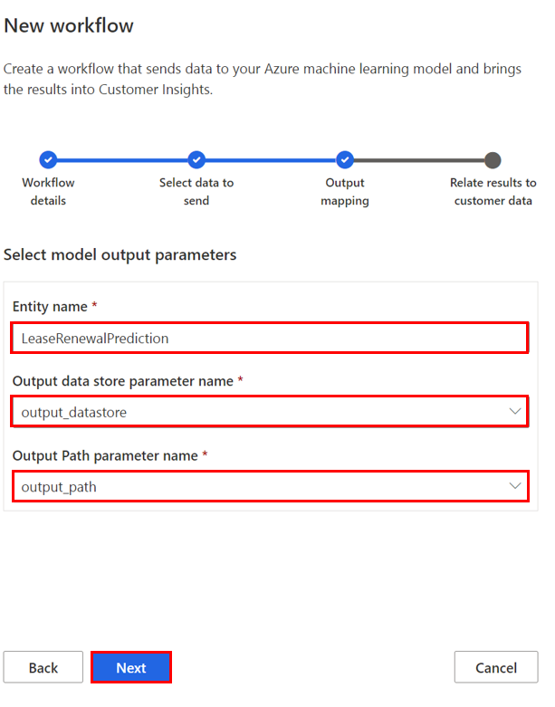

* Select "cid" for the Customer ID and click "Save"

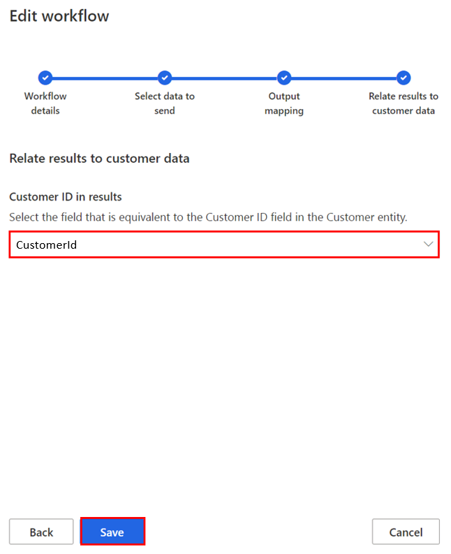

## Step 8.4: Renewal Prediction Measure
* Navigate to the Measure tab, click "+ New" and select "Build your own" 
* Provide a name for your measure
* Select the "Average" function, enter `LeaseRenewalPrediction.RenewalPredictionScore * 100` in the attribute field

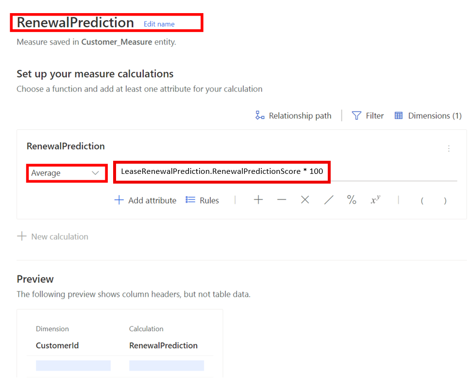

* Click "Save and close"

# Step 9: Enrichments
## Step 9.1 Interests 
1. Navigate to Data > Enrichments and click "+ Add enrichment" 
2. Select Interests and select "Next" 
3. Under Enter interests manually search the following five interests as shown below and click "Next"

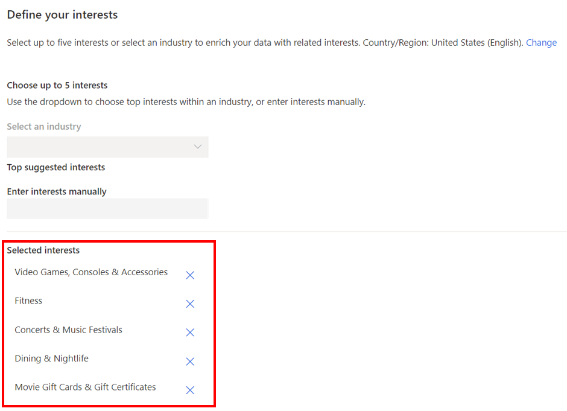

4. Select "Low" and "Exact (recommended)" as shown below and click "Next"

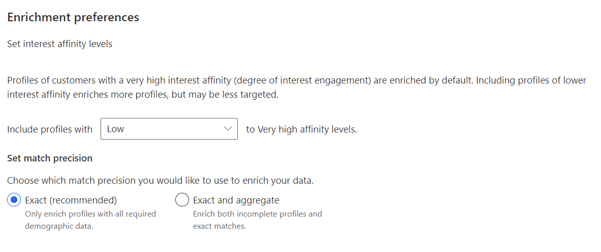

5. Select "Customer" for Customer data set and click "Next"

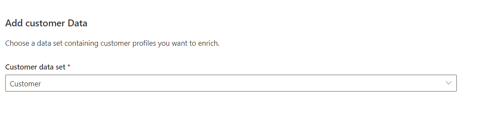

6. Select the Demographics ad Location as shown below and click "Next"

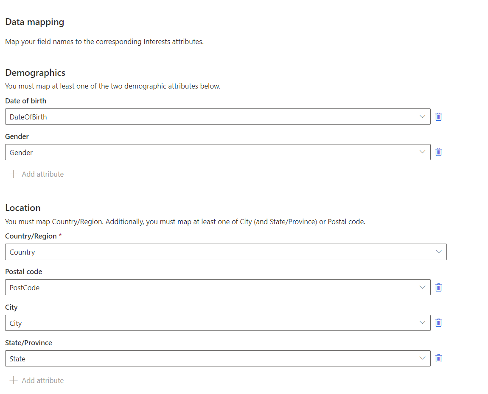

7. Review and run your Interests Enrichment 

## Step 9.2 Brands 
1. Navigate to Data > Enrichments and click "+ Add enrichment" 
2. Select Brands and select "Next" 
3.  Under Enter brands manually search the following five brands as shown below and click "Next"

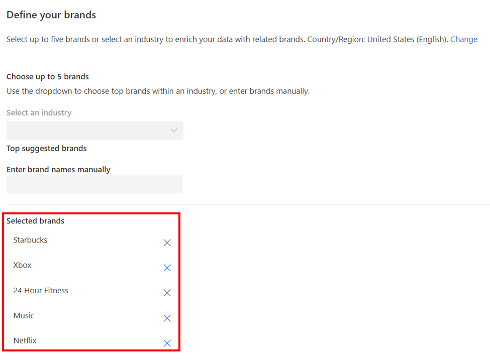

4. Select "Low" and "Exact (recommended)" as shown below and click "Next"

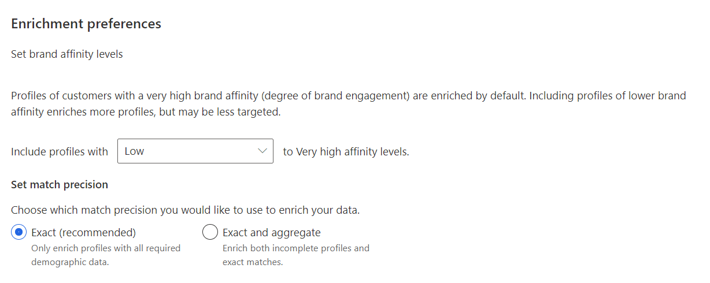

5. Select "Customer" for Customer data set and click "Next"

6. Select the Demographics ad Location as shown below and click "Next"

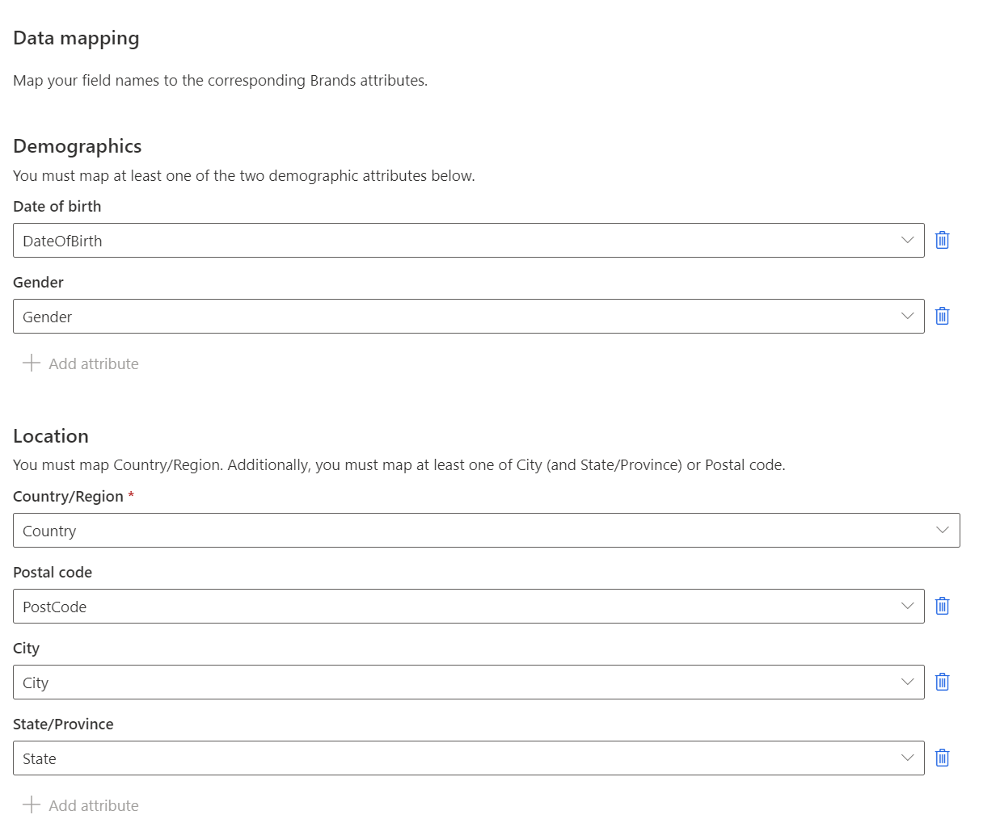

7. Review and run your Brands Enrichment 

# Step 10: Set up Lease Renewal Predictions 
1. Navigate to Step 7 in the [Azure Set Up Documentaion](./AzureSetup.md)

## Step 10.1: Load Data
In this step you will bring the Lease Renewal Preductions data into the CI environment from your Azure Synapse Workspace. 
1. In the CI environment, navigate to the Data > Data Source
2. Select `Add Data Source` and select `Connect to a Common Data Model folder`, provide a name for your Common Data Model folder and click "Next". 

 

3. Under "Connect your storage account using" select `Azure subscription`

4. Select `synapse`, select `/synapse/default.manifest.cdm.json` and click "Next"

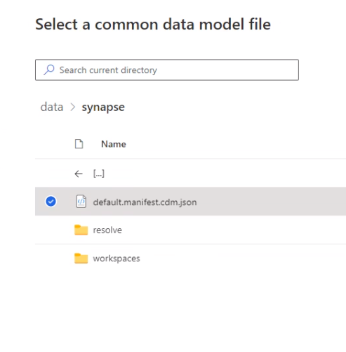

5. Select all model entities and click "Next"
6. Select all entities to enable data profiling and select "Save"

## Step 10.2: Set up Relationship 
1. Provide a name for the relationship 
2. Under Source details select `LeaseResewalPrediction:predictions` for "Entity", `One` for "Cardinality" and `CustomerId` for "Source field"
3. Under Target details select `Customer:CustomerInsights` for "Entity", `One` for "Cardinality" and `CustomerId` for "Target field" and click "Save"

## Step 10.3: Measure Lease Renewal Predictions 
1. Navigate to the Measure tab, click "+ New" and select "Build your own" 
2. Select "Dimensions", click the trash can icon to remove the dimension and click "Apply" 
3. Select "Edit name" and provide `Lease Renewal Predictions` for your measure name
4. Select "Edit name" under the Calculation, provide `Lease Renewal Predictions` for the calculation name and click "Done" 
5. Select `First` from the drop down 
6. Select "+ Add attribute", select `predictions_lease_renewal_prediction.RenewalPrediction` from the attributes list and click "Add"
6. Click "Save and close" 
7. Select Edit on the "Lease Renewal Predictions"  
8. Select "Dimensions", select `CustomerInsights.CustomerId` and select "Apply"  
9. Select "Relationship", select `predictions_lease_renewal > Customer` and select "Done"
10. Select "Run" 

# Step 11: Power BI Set Up 
1. Open the [Power BI report](./Report/Customer360Dashboard.pbix) in this repository

2. Click the Transform data dropdown and click Data source settings 

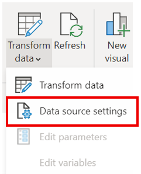

3. Select the Azure Synapse Workspace connection, select "Change Source..." and provide your SQL Server Database name under Server and click "OK" 
    * Navigate to the Synapse Workspace overview page in the Azure Portal, copy the Serverless SQL endpoint
4. Select "Edit Permissions", under Credentials select "Edit", sign in to your Microsoft Account, click "OK" and click "Close"
5. Click Transform data dropdown and click Transform data

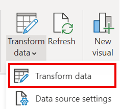

6. Select UnifiedActivity on the left under Queries, select Home and click Advanced editor

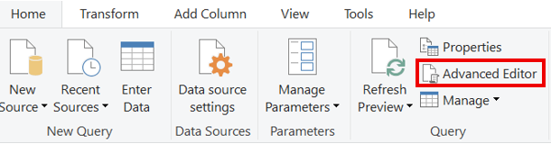

7. Replace InstanceId with your CI instance ID and click "Done" 
    * Navigate to your CI environment and copy the instance id in the URL of the webpage

8. Repeat step 7 for the Customer, LeaseRenewalPredictions, SalesOrderLine, Customer_Measure, InterestAffinityFromMicrosoft, BrandAffinityFromMicrosoft, LeasesEndingin90Days, Subscription and TTV queries
9. Select Home and click "Close & Apply" 
10. Click Refresh Data 

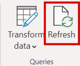