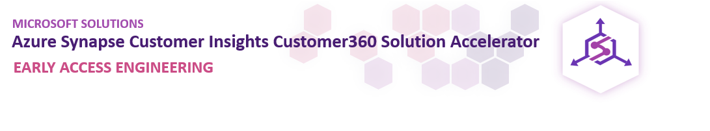
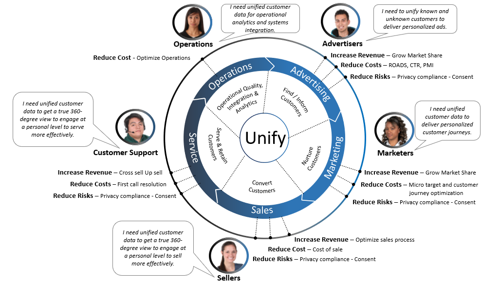
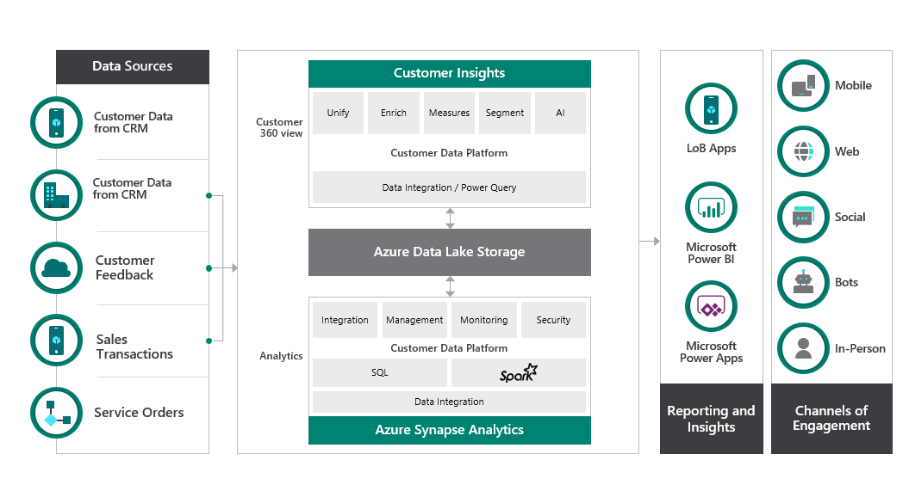
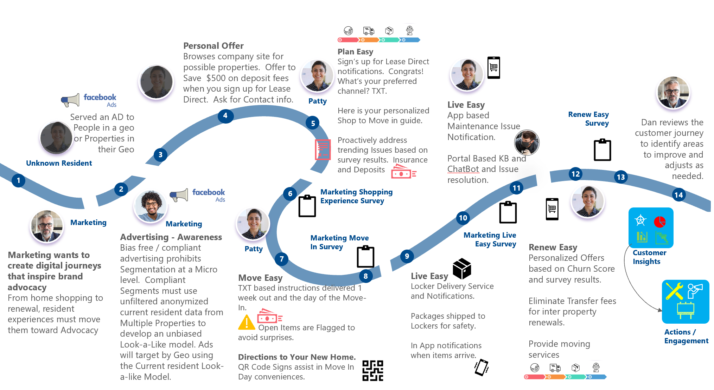
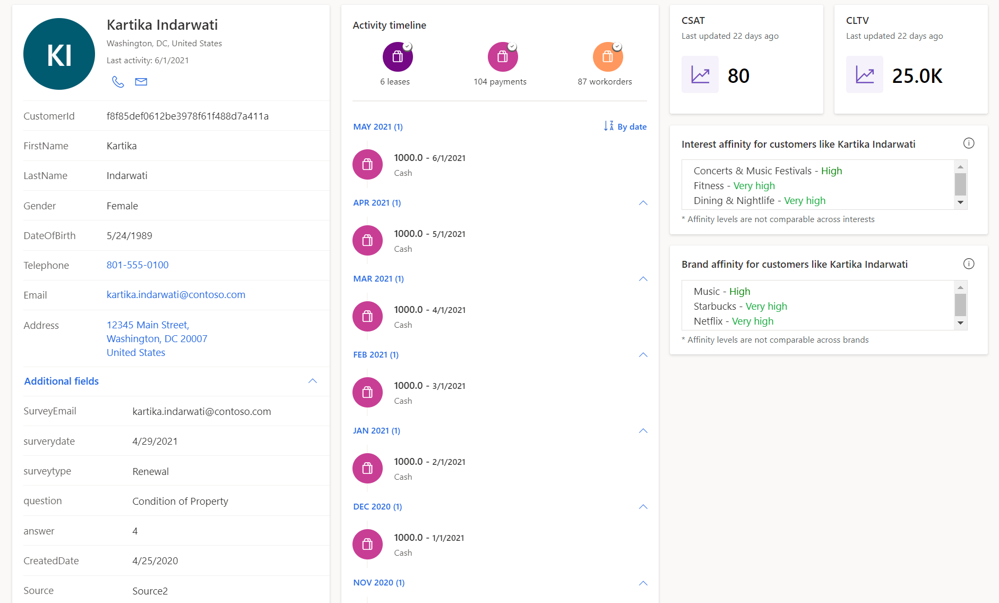
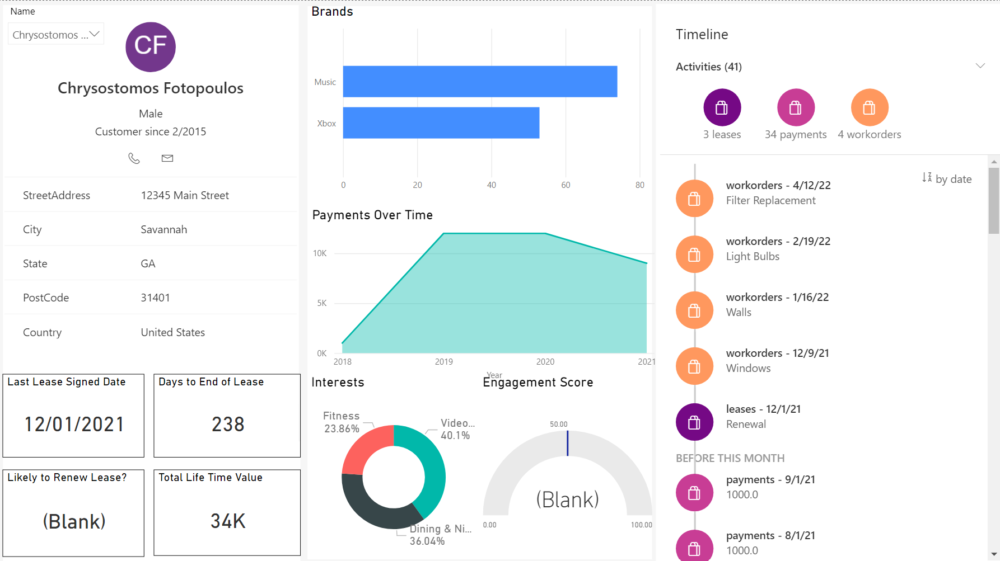
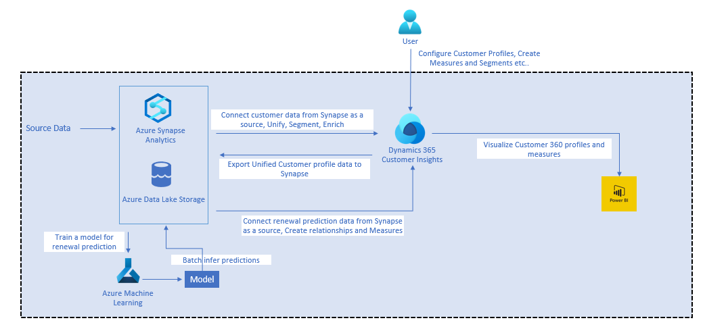

## About this Repository 

Managing customer data from multiple sources and building a unified Customer 360 view is not a new challenge. But it is becoming increasingly difficult with increased number of interaction channels and touch-points with customers. By combining the power of Azure Synapse Analytics with Dynamics 365 Customer Insights, we can help organizations build a comprehensive view of customers and enable them to provide the best customer experience.

This solution accelerator helps developers with all the resources needed to build an end-to-end Customer 360 solution.

## Why Customer 360?

## Sample Customer 360 Solution Process Flow

## Customer End-to-End Experience – Shop to Renew

## Prerequisites
To use this solution accelerator, you will need access to an [Azure subscription](https://azure.microsoft.com/free/) and a Customer Insights Environment. While not required, a prior understanding of Customer Insights, Azure Synapse Analytics and Machine Learning will be helpful.

For additional training and support, please see:

1. [Azure Synapse Analytics](https://azure.microsoft.com/en-us/services/synapse-analytics/) 
2. [Dynamics 365 Customer Insights](https://dynamics.microsoft.com/en-us/ai/customer-insights/) 
3. [Azure Machine Learning](https://azure.microsoft.com/en-us/services/machine-learning/) 

## Overview
This solution accelerator showcases the cross-solution integration of Azure Synapse Analytics and Dynamics 365 Customer Insights. The [Getting Started guide](https://github.com/microsoft/Azure-Synapse-Customer-Insights-Customer360-Solution-Accelerator#getting-started) helps you through the below steps: 
1. Deploy all the Azure resources needed for this solution. 
2. Load the sample data provided as part of the repository or bring your own data
3. Create Dynamics 365 Customer Insights Environment   
4. Configure Customer 360 Profiles: 
    * Load customer data from ADLS/Azure Synapse Analytics to Customer Insights.
    * Unify customer records coming from different CRM systems based on fields like Email, Last Name, Date of Birth etc. to get to a unique customer record
    * Configure customer activities like Leases, Workorders, Payments, Surveys
    * Create Customer Segments to be sent to CRM or other campaign management systems to run promotions for customer retention. Some sample segments: 
        * Customers whose leases are up for renewal
        * Customers with many past work orders 
        * Customer with lower satisfaction scores
    * Configure data enrichments to know customers' affinity to specific brands and interests. 
5. Create Intelligence 
    * Configure Customer Lifetime Value using a pre-built model in CI.
    * Export the unified customer profiles from CI to Azure Synapse Analytics, train a custom ML model to predict the probablity of a customer renewing their lease, and load the model predictions to CI to be used in Segment creation. 
4. Connect to Power BI 
    * Download the Power BI report from this repository and change connections to your environment 

## Getting Started
Start by deploying the required resources to Azure. The button below will deploy Azure Synapse Analytics, Azure Machine Learning and its related resources:

* Go to the [Deployment guide](./Deployment/AzureSetup.md) to set up Azure and Customer Insights environments. 
* After following the deployment guide, you can see the customer 360 profiles with the two options below: 
    * [Customer Insights environment](https://home.ci.ai.dynamics.com/) 
    * Power BI Dashboard you configured in the [CI Step 11](https://github.com/microsoft/Azure-Synapse-Customer-Insights-Customer360-Solution-Accelerator/blob/main/Deployment/CustomerInsightsSetup.md#step-11-power-bi-set-up)

## Sample Customer Insights Customer 360 view

## Sample Power BI Customer 360 view

## Architecture
The architecture diagram below details what you will be building for this Solution Accelerator.

## License
MIT License

Copyright (c) Microsoft Corporation.

Permission is hereby granted, free of charge, to any person obtaining a copy
of this software and associated documentation files (the "Software"), to deal
in the Software without restriction, including without limitation the rights
to use, copy, modify, merge, publish, distribute, sublicense, and/or sell
copies of the Software, and to permit persons to whom the Software is
furnished to do so, subject to the following conditions:

The above copyright notice and this permission notice shall be included in all
copies or substantial portions of the Software.

THE SOFTWARE IS PROVIDED "AS IS", WITHOUT WARRANTY OF ANY KIND, EXPRESS OR
IMPLIED, INCLUDING BUT NOT LIMITED TO THE WARRANTIES OF MERCHANTABILITY,
FITNESS FOR A PARTICULAR PURPOSE AND NONINFRINGEMENT. IN NO EVENT SHALL THE
AUTHORS OR COPYRIGHT HOLDERS BE LIABLE FOR ANY CLAIM, DAMAGES OR OTHER
LIABILITY, WHETHER IN AN ACTION OF CONTRACT, TORT OR OTHERWISE, ARISING FROM,
OUT OF OR IN CONNECTION WITH THE SOFTWARE OR THE USE OR OTHER DEALINGS IN THE
SOFTWARE

## Contributing
This project welcomes contributions and suggestions.  Most contributions require you to agree to a Contributor License Agreement (CLA) declaring that you have the right to, and actually do, grant us the rights to use your contribution. For details, visit https://cla.opensource.microsoft.com.

When you submit a pull request, a CLA bot will automatically determine whether you need to provide a CLA and decorate the PR appropriately (e.g., status check, comment). Simply follow the instructions provided by the bot. You will only need to do this once across all repos using our CLA.

This project has adopted the [Microsoft Open Source Code of Conduct](https://opensource.microsoft.com/codeofconduct/). For more information see the [Code of Conduct FAQ](https://opensource.microsoft.com/codeofconduct/faq/) or contact [opencode@microsoft.com](mailto:opencode@microsoft.com) with any additional questions or comments.

## Trademarks
This project may contain trademarks or logos for projects, products, or services. Authorized use of Microsoft trademarks or logos is subject to and must follow [Microsoft's Trademark & Brand Guidelines](https://www.microsoft.com/en-us/legal/intellectualproperty/trademarks/usage/general). Use of Microsoft trademarks or logos in modified versions of this project must not cause confusion or imply Microsoft sponsorship. Any use of third-party trademarks or logos are subject to those third-party's policies.

## Data Collection
The software may collect information about you and your use of the software and send it to Microsoft. Microsoft may use this information to provide services and improve our products and services. You may turn off the telemetry as described in the repository. There are also some features in the software that may enable you and Microsoft to collect data from users of your applications. If you use these features, you must comply with applicable law, including providing appropriate notices to users of your applications together with a copy of Microsoft's privacy statement. Our privacy statement is located at https://go.microsoft.com/fwlink/?LinkID=824704. You can learn more about data collection and use in the help documentation and our privacy statement. Your use of the software operates as your consent to these practices.

